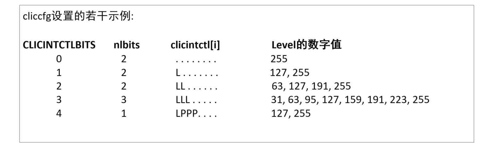

### **6.2.9. ECLIC中断源的级别和优先级（Level and Priority）**

如图 6-2所示，ECLIC的每个中断源均可以设置特定的级别和优先级（通过寄存器clicintctl[i]），其要点如下：

- 每个中断源的clicintctl[i]寄存器理论上有8位宽，其中硬件真正实现的位有效位数由clicinfo寄存器的CLICINTCTLBITS域来指定。譬如，假设clicinfo.CLICINTCTLBITS域的值为6，则表示clicintctl[i]寄存器只有高6位是真正的有效位，最低2位的值为常数1，如图 6-3中示例所示。
  - 注意：CLICINTCTLBITS域的值是只读的固定常数，软件无法对其进行编程改写。其理论上的合理范围是2 <= CLICINTCTLBITS <= 8，具体的实际值由处理器内核的硬件实现决定。
- 在clicintctl[i]寄存器的有效位中，包含两个动态的域，分别用于指定该中断源的级别（Level）和优先级（Priority）。Level域的宽度由cliccfg寄存器的nlbits域来指定。譬如，假设cliccfg.nlbits域的值为4，则表示clicintctl[i]寄存器有效位的高4位是Level域，其他的低位有效位为Priority域，如图 6-3中示例所示。
  - 注意：cliccfg.nlbits域的值是可读可写域，软件可以对其进行编程改写。

​                                                            **
图 6-3 寄存器clicintctl[i]的格式示例
**

- 中断源的级别（Level）相关的要点如下：
  - Level的数字值采取左对齐的方式进行解读，有效位宽（由cliccfg.nlbits指定）之外的低位全部采用补常数1的方式填充，如图 6-4中示例所示。
    - 注意：如果cliccfg.nlbits > clicinfo.CLICINTCTLBITS，则意味着nlbits指示的位数超出了clicintctl[i]寄存器的有效位，则超出的位全部采用补常数1的方式填充。
    - 注意：如果cliccfg.nlbits = 0，Level的数字值会被认为是固定的255。如图 6-5中示例所示。
  - Level的数字值越大，则表示其级别越高，注意：
    - 高级别的中断可以打断低级别的中断处理，从而形成中断嵌套，请参见第5.11节的详细介绍。
    - 多个中断同时等待（IP位为高），ECLIC需要仲裁决定哪个中断被发送给内核进行处理，仲裁时需要参考每个中断源的Level数字值。请参见第5.5节的详细介绍。

​                                                             **
图 6-4 Level的数字值解读方式
**

​                                                             **
图 6-5 cliccfg设置的若干示例
**

- 中断源的优先级（Priority）相关的要点如下：
  - Priority的数字值也采取左对齐的方式进行解读，有效位宽（clicinfo.CLICINTCTLBITS -cliccfg.nlbits）之外的低位全部采用补常数1的方式填充。
  - Priority的数字值越大，则表示其优先级越高，注意：
    - 中断优先级（Priority）不参与中断嵌套的判断，即中断能否嵌套与中断优先级（Priority）的数值大小没有关系，而是与中断级别（Level）的数值大小有关。
    - 多个中断同时Pending时，ECLIC需要仲裁决定哪个中断被发送给内核进行处理，仲裁时需要参考每个中断源的Priority数字值。请参见第6.2.12节的详细介绍。

