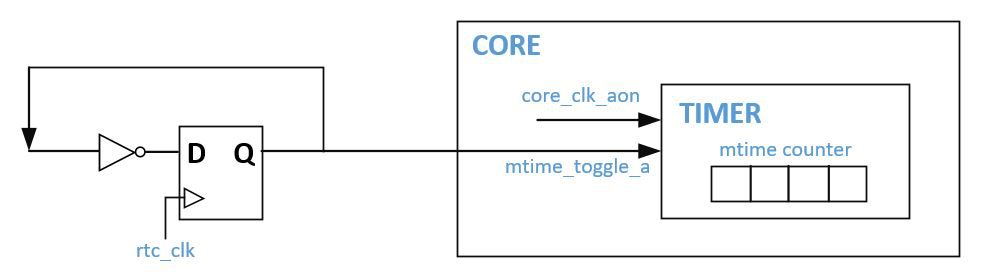

# 1. **Bumblebee内核概述**

​		Bumblebee处理器内核（Processor Core），简称Bumblebee内核，是由芯来科技（Nuclei System Technology）联合兆易创新（Gigadevice）针对其面向IoT或其他超低功耗场景的通用MCU产品定制的一款商用RISC-V处理器内核，专用于型号为GD32VF103的MCU产品。

注意：针对该MCU所使用的Bumblebee内核为芯来科技（Nuclei System Technology）与台湾晶心科技（Andes Technology）联合开发，由芯来科技（Nuclei System Technology）提供授权以及技术支持等服务。

​	目前芯来科技（Nuclei System Technology）可授权完全国产自主可控的N200系列超低功耗商用处理器内核IP，以及多个系列（300/600/900系列）的32位架构和64位架构高性能嵌入式处理器内核IP，并为客户提供处理器IP定制化服务。

## 1.1.**Bumblebee内核特性列表**

​		Bumblebee内核的特性列表如下：

- CPU内核（CPU Core）
  - 2级变长流水线架构，采用一流的处理器架构设计，实现业界最高的能效比与最低的成本。
  - 简单的动态分支预测器。
  - 指令预取单元，能够按顺序预取两条指令，从而隐藏指令的访存延迟。
  - 支持机器模式（Machine Mode）和用户模式（User Mode）。
- 支持指令集架构（ISA，Instruction Set Architecture）
  - lBumblebee内核支持32位的RISC-V指令集架构，支持RV32IMAC指令子集的组合。
  - 硬件支持非对齐（Misalign）的存储器访问操作（Load/Store指令）
- 总线接口
  - 支持32比特宽的标准AHB-Lite系统总线接口，用于访问外部指令和数据。
  - 支持32比特宽的指令局部存储器（Instruction Local Memory，ILM）总线接口（支持标准的AHB-Lite或SRAM接口协议），用于连接私有的指令局部存储器。
  - 支持32比特宽的数据局部存储器（Data Local Memory，DLM）总线接口（支持标准的AHB-Lite或SRAM接口协议），用于连接私有的数据局部存储器。
  - 支持32比特宽的私有设备总线（Private Peripheral Interface，PPI），支持标准的APB接口协议，用于连接私有的外设。
- 调试功能
  - 支持标准JTAG接口。
  - 支持RISC-V调试标准。
  - 支持4个硬件断点（Hardware Breakpoints）。
  - 支持成熟的交互式调试工具。
- 低功耗管理
  - 支持WFI（Wait For Interrupt）与WFE（Wait For Event）进入休眠模式。
  - 支持两级休眠模式：浅度休眠与深度休眠。
- 内核私有的计时器单元（Machine Timer，简称TIMER）
  
  - 64比特宽的实时计时器，支持产生RISC-V标准定义的计时器中断。
- 增强的内核中断控制器（Enhanced Core Level Interrupt Controller，ECLIC）
  - 支持RISC-V标准定义的的软件中断、计时器中断和外部中断。
  - 支持数十个外部中断源，中断源的数目和分配请参见具体MCU芯片的数据手册。
  - 支持16个中断级别和优先级，支持软件动态可编程修改中断级别和中断优先级的数值。
  - 支持基于中断级别的中断嵌套。
  - 支持快速向量中断处理机制。
  - 支持快速中断咬尾机制。
- 支持NMI（Non-Maskable Interrupt）。
- 软件开发工具：
  - Bumblebee内核支持RISC-V标准的编译工具链，以及Linux/Windows图形化集成开发环境（Integrated Development Environment，IDE）。
  
    

## **1.2.** **Bumblebee内核指令集与架构**

​		Bumblebee内核支持的指令集和架构详情请参见《Bumblebee内核指令架构手册》。

## **1.3.** **Bumblebee内核层次结构图**

​		Bumblebee内核的顶层如图 1-1所示。Bumblebee内核的组织结构主要包含如下要点：

- Core为整个处理器内核的顶层。
- uCore位于Core层次结构之下，为处理器内核的主体部分。
- 除了uCore之外，在Core层次结构之下还包含了如下主要组件：
  - DEBUG：处理JTAG接口和相关的调试功能。
  - ECLIC：中断控制单元。
  - TIMER：计时器单元。
  - LM Ctrl：对外部ILM和DLM接口的控制。
  - BIU：对外部PPI接口和MEM接口的控制。
  - Misc Ctrl：其他控制模块。

 
​                                          ** 
图 1-1 Bumblebee内核顶层示意图
**

# 2. **Bumblebee内核功能简介**

## **2.1.** **Bumblebee内核时钟域介绍**

​	Bumblebee内核的时钟域划分如图 2-1中所示，整个处理器内核分为两个彼此异步的时钟域：

- 工作时钟域，由输入的时钟core_clk和core_clk_aon驱动处理器内核的绝大部分功能逻辑。注意：

  - core_clk和core_clk_aon为来自于同一个时钟源的同频同相时钟。
  - core_clk为主工作时钟，驱动处理器内核内部的主要工作逻辑，并且可以在系统层面上被全局门控。
  - core_clk_aon为常开时钟，驱动内核中的常开（Always-On）逻辑，主要包括ECLIC、TIMER以及DEBUG。有关ECLIC和TIMER的详情请参见《Bumblebee内核指令架构手册》。

- JTAG时钟域，由输入的信号jtag_TCK驱动处理器内核的JTAG调试相关逻辑。

  上述两个时钟域之间完全异步，在处理器内核的内部实现中已经进行了异步跨时钟域的处理。

 

**
图2-1 Bumblebee内核时钟域示意图
**

## 2.2. **Bumblebee内核电源域介绍**

​		Bumblebee内核的内部并没有划分电源域，SoC系统集成者可以根据Bumblebee内核的层次结构自行划分电源域和进行跨电源域处理。

## 2.3. **Bumblebee内核地址空间分配**

​		Bumblebee内核的地址空间请参见具体MCU芯片的数据手册。

## 2.4. **Bumblebee内核的特权模式**

​		Bumblebee内核支持两个特权模式（Privilege Modes）：机器模式（Machine Mode）和用户模式（User Mode）。有关Privilege Modes的详情请参见《Bumblebee内核指令架构手册》。

## 2.5. **Bumblebee内核的存储器资源**

​		Bumblebee内核支持如下类型的存储器资源：

- ILM：

  -  Bumblebee内核如果配置了指令局部存储器（Instructon Local Memory，ILM）接口，则支持通过专有的AHB-Lite总线或者SRAM接口访问ILM。
  -  ILM的大小可以配置。ILM接口有独立的地址区间，用户可以配置具体的基地址，请参见第2.3节了解其详情。
  -  ILM由SoC系统集成者自行实现，一般可以是用于存放指令的片上SRAM或者片上Flash。如果使用AHB-Lite接口，要达到最佳性能，ILM应该遵循AHB协议规则，在收到地址后的下一个周期返回指令。

- DLM：

  - Bumblebee内核如果配置了数据局部存储器（Data Local Memory，DLM）接口，则支持通过专有的AHB-Lite总线或则SRAM接口访问DLM。

  - DLM的大小可以配置。DLM接口有独立的地址区间，用户可以配置具体的基地址，请参见第2.3节了解其详情。

  - DLM由SoC系统集成者自行实现，一般可以是用于存放数据的片上SRAM。如果使用AHB-Lite接口，要达到最佳性能，DLM应该遵循AHB协议规则，在收到地址后的下一个周期返回数据。

    

## 2.6. **Bumblebee内核的私有设备**

​		如图 1-1中所示，Bumblebee内核的Core层次结构之下，除了uCore之外，还包含了如下私有设备：

- DEBUG：处理JTAG接口和相关的调试功能。
- ECLIC：内核中断控制单元。
- TIMER：内核私有计时器单元。

上述设备属于处理器内核私有，使用存储器地址寻址方式进行访问，有关其具体的地址区间分配请参见第2.3节。

## 2.7. **Bumblebee内核的物理存储保护**

​		由于Bumblebee内核是面向微控制器领域的低功耗内核，其不支持虚拟地址管理单元（Memory Management Unit），因此所有的地址访问操作都是使用的物理地址。为了根据不同的存储器物理地址区间和不同的Privilege Mode进行权限隔离和保护，RISC-V架构标准定义了物理存储保护机制，即（Physical Memory Protection，PMP）单元。

注意：Bumblebee内核并不支持PMP单元。

## 2.8. **Bumblebee内核的调试机制**

​		Bumblebee内核支持标准的JTAG调试接口，以及成熟的交互式调试工具GDB。注意：

- Bumblebee内核支持的硬件断点（Hardware Breakpoint）数目为4个。硬件断点主要用于向只读区间（譬如Flash）设置断点。
- Bumblebee内核定义了一根输入信号，i_dbg_stop可以通过其输入信号的值来进行控制：
- 如果i_dbg_stop信号的值为1，则处理器内核的调试功能被关闭。
- 如果i_dbg_stop信号的值为0，则处理器内核的调试功能正常工作。

## 2.9. **Bumblebee内核的中断和异常机制**

​		有关Bumblebee内核的中断和异常机制详细介绍，请参见《Bumblebee内核指令架构手册》。

## 2.10. **Bumblebee内核的NMI机制**

​		NMI（Non-Maskable Interrupt）是处理器内核的一根特殊的输入信号，往往用于指示系统层面的紧急错误（譬如外部的硬件故障等）。在遇到NMI之后，处理器内核应该立即中止执行当前的程序，转而去处理该NMI错误。有关Bumblebee内核的NMI机制详细介绍，请参见《Bumblebee内核指令架构手册》。

## 2.11. **Bumblebee内核的CSR寄存器**

​		RISC-V的架构中定义了一些控制和状态寄存器（Control and Status Register，CSR），用于配置或记录一些运行的状态。CSR寄存器是处理器核内部的寄存器，使用其专有的12位地址编码空间。详情请参见《Bumblebee内核指令架构手册》了解其详情。

## 2.12. **Bumblebee内核的性能计数器**

​		RISC-V架构定义了如下两种性能计数器：

- 时钟计数器（Cycle Counter）：

  - 一个64位宽的时钟周期计数器，用于反映处理器执行了多少个时钟周期。只要处理器处于执行状态时，此计数器便会不断自增计数。
  - CSR寄存器mcycle反映了该计数器低32位的值，CSR寄存器mcycleh寄存器反映了该计数器高32位的值。有关mcycle和mcycleh的详情请参见《Bumblebee内核指令架构手册》。

- 指令完成计数器（Instruction Retirement Counter）：

  - RISC-V架构定义了一个64位宽的指令完成计数器，用于反映处理器成功执行了多少条指令。只要处理器每成功执行完成一条指令，此计数器便会自增计数。
  - CSR寄存器minstret反映了该计数器低32位的值，CSR寄存器minstreth反映了该计数器高32位的值。有关minstret和minstreth的详情请参见《Bumblebee内核指令架构手册》。

  时钟计数器（Cycle Counter）和指令完成计数器（Instruction Retirement Counter）通常用于测量性能。默认情况下，计数器在内核复位后的值为0，然后一直不断的自增计数。由于考虑到计数器计数会消耗某些动态功耗，因此在Bumblebee内核的实现中，在自定义的CSR寄存器mcountinhibit中额外增加了若干位控制域，软件可以配置相应的控制域分别将不同的计数器关停，从而在不需要使用它们之时停止计数以达到省电的作用。
  
  ​	有关CSR寄存器mcountinhibit的详情请参见《Bumblebee内核指令架构手册》。

## 2.13. **Bumblebee内核的计时器单元**

​		RISC-V架构定义了一个64位的计时器（Timer Counter），该计时器按照系统的低速实时时钟（Real Time Clock）频率进行计时。该计时器的值实时反映在mtime寄存器中。RISC-V架构还定义了一个64位的mtimecmp寄存器，该寄存器作为计时器的比较值，假设计时器的值mtime大于或者等于mtimecmp的值，则产生计时器中断。

​		注意：RISC-V架构没有将mtime和mtimecmp寄存器定义为CSR寄存器，而是定义为存储器地址映射（Memory Address Mapped）的系统寄存器，具体的存储器映射地址RISC-V架构并没有规定，而是交由内核设计者自行实现。在Bumblebee内核的实现中，mtime/mtimecmp均由TIMER单元实现，有关Bumblebee内核的TIMER单元详情请参见《Bumblebee内核指令架构手册》。

### **2.13.1.** **调试模式时的计时器行为**

​		当Bumblebee内核在处于调试模式时会偶尔执行一些调试器（Debugger）设定的代码（DEBUG单元中，对于用户透明不可见）以支持调试器的功能。如果在执行这些调试器设定的代码时计时器仍然计数，则无法真实反映被调试的程序的真实行为。因此Bumblebee内核在执行调试器设定的代码时，计时器会自动停止计数。

 

### **2.13.2.** **正常模式时的计时器行为**

​		默认情况下，计时器在内核复位后的值为0，然后一直不断的自增计时。由于考虑到计时器计数会消耗某些动态功耗，因此在Bumblebee内核的实现中，在自定义的CSR寄存器mcountinhibit中额外增加了一个位控制域，软件可以配置该控制域将计时器关停，从而在不需要使用它们之时停止计数以达到省电的作用。有关CSR寄存器mcountinhibit的详情请参见《Bumblebee内核指令架构手册》。

## 2.14 **Bumblebee内核的低功耗机制**

​		Bumblebee内核的低功耗机制体现在如下几个方面：

- Bumblebee内核内部的各个主要单元的时钟在空闲时都会自动地会被门控关闭以节省静态功耗。
- Bumblebee内核能够通过常见的WFI（Wait for Interrupt）和WFE（Wait for Event）机制支持休眠（Sleep）模式以实现较低的动态和静态功耗，有关 “Wait for Interrupt”和“Wait for Event”的详情请参见《Bumblebee内核指令架构手册》。

### **2.14.1.** **进入休眠状态的时钟控制**

​		Bumblebee内核可以通过执行WFI指令进入休眠状态，有关“如何进入休眠状态”的具体详情请参见《Bumblebee内核指令架构手册》。

​		Bumblebee内核的输出信号core_sleep_value可以用于指示不同的休眠模式（0或者1），通常可以用休眠模式0作为浅度休眠，休眠模式1作为深度休眠。注意：当进入深度休眠模式之后，处理器内核将不能够再被JTAG调试接口进行调试。

​	处理器内核进入休眠状态时的时钟控制（参考方案）要点如下：

- 如图 2-1中，当成功的执行了WFI后，Bumblebee内核的输出信号core_wfi_mode会拉高，指示此处理器核处于执行WFI指令之后的休眠状态；SoC系统层面可以使用core_wfi_mode控制外部的总门控时钟将处理器内核的主工作时钟core_clk关闭。
- 如果Bumblebee内核进入的是深度休眠模式（core_sleep_value为1），SoC系统可以根据其实际情况决定是否将处内核的常开时钟core_clk_aon也关闭。

 

### **2.14.2.** **退出休眠状态的时钟控制**

​		处理器内核可以被中断（Interrupt）、事件（Event）或者NMI唤醒，有关“如何退出休眠状态”的具体详情请参见《Bumblebee内核指令架构手册》。

​		处理器内核退出休眠状态时的时钟控制要点如下：

- 如果是等待中断（Interrupt）的唤醒，由于Bumblebee内核的中断需要经过ECLIC单元的处理和分发，中断只有通过了使能和优先级阈值等条件的判断之后，才能够唤醒内核。除此之外，还需特别注意处理器内核的常开时钟（core_clk_aon）是否关闭：
  - 如第2.1节中所述，由于TIMER受core_clk_aon驱动，因此：
    - 假设SoC系统层面已经将处理器内核的常开时钟（core_clk_aon）关闭，则TIMER单元由于无时钟，因此其无法产生计时器中断和软件中断。
  - 如第2.1节中所述，由于ECLIC受core_clk_aon驱动，因此：
    - 假设SoC系统层面已经将处理器内核的常开时钟（core_clk_aon）关闭，外部中断信号线拉高之后必须一直保持，直到SoC系统层面将处理器内核的的常开时钟（core_clk_aon）再次打开。否则处理器内核的ECLIC单元由于没有时钟，无法采样到外部中断信号，从而导致处理器内核无法被唤醒。
- 如果是等待事件（Event）或者NMI的唤醒，则内核一旦（通过core_clk_aon时钟）采样到输入信号rx_evt（Event信号，高电平有效）或者nmi（NMI信号，上升沿有效），便从休眠状态中被唤醒。除此之外，还需特别注意处理器内核的常开时钟（core_clk_aon）是否关闭：
  - 假设SoC系统层面已经将处理器内核的常开时钟（core_clk_aon）关闭，输入信号rx_evt或者nmi拉高之后必须一直保持，直到SoC系统层面将处理器内核的的常开时钟（core_clk_aon）再次打开。否则处理器内核的Event和NMI采样逻辑由于没有时钟，无法采样到Event和NMI，从而无法被唤醒。
- 处理器被唤醒后则会马上将输出信号core_wfi_mode拉低。假设SoC系统层面使用了core_wfi_mode控制内核的core_clk门控时钟，则随着core_wfi_mode信号的拉低，处理器内核的工作时钟core_clk将会重新被打开。

 

# 3. **Bumblebee内核接口介绍**

## **3.1.** **Bumblebee内核接口简介**

​		Bumblebee内核包含如下几类接口：

- 时钟和复位接口

- 调试接口

- 外部中断接口

- 总线接口，包含如下接口：

  - ILM主接口（ILM Master Interface）：访问外部的ILM的接口。
  - DLM主接口（DLM Master Interface）：访问外部的DLM的接口。
  - PPI接口（Private Priperhal Interface）：访问外部私有外设总线的接口。
  - MEM接口（System Memory Interface）：访问系统总线的接口。

- 其他功能接口

  由于Bumblebee内核的接口信号主要是MCU内部的细节，因此关于接口信号的详细信息，本文档不做过多介绍。本文档仅对于一个输入信号mtime_toggle_a信号进行介绍，因为此信号的相关信息对于MCU嵌入式软件开发不可或缺。

**
表 3-1 mtime_toggle_a接口信号
**

| 信号量         | 方向 | 位宽 | 描述                                                         |
| -------------- | ---- | ---- | ------------------------------------------------------------ |
| mtime_toggle_a | 描述 | 1    | 来自于SoC系统层面的脉冲信号mtime_toggle_a，用于驱动Core内部TIMER单元的计时器。  注意：        该信号被当做异步输入信号。 在Core内部会对该信号进行异步信号同步处理（使用几级寄存器进行同步）。        在进行同步处理之后，会根据Core的主时钟对此信号进行上升沿和下降沿的检测，任何一个边沿检测到就会触发TIMER的计时器自增加一。      建议此信号使用慢速时钟（rtc_clk）驱动的寄存器输出（即2分频）作为输入信号，处理器内核内部进行上下边沿检测后产生的自增频率即等于慢速时钟的频率，如图 3-1中所示 。慢速时钟的频率越低，则内部计时器的自增频率越低，可以降低动态功耗。 |

 

​    **
图 3-1 mtime_toggle_a信号生成示意图
**

​	注意：在型号为GD32VF103的MCU产品中，rtc_clk时钟为Bumblebee内核主时钟core_clk_aon的四分频，即mtime_toggle_a驱动Core内部TIMER单元的计时器计数频率为Bumblebee内核主时钟的四分频。

[点击返回RISCV-MCU](https://c886923480mqy.scd.wezhan.cn/sy)

