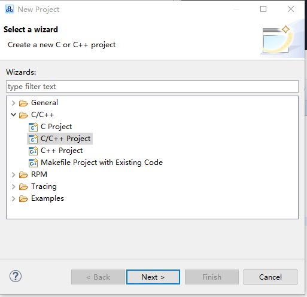

如需更多的信息，请访问[www.riscv-mcu.com](http://www.riscv-mcu.com)

# **Nuclei Studio IDE快速上手册**

&nbsp;&nbsp;&nbsp;&nbsp&nbsp;&nbsp;&nbsp;&nbsp;本文将介绍如何使用基于Nuclei Studio的Windows开发调试环境对GigaDevice GD32MCU系列产品（本文所采用的具体硬件工具是GD32V103V-EVAL-V1.0开发板）进行开发和调试。

## **1.Nuclei Studio IDE简介、下载与安装**

## **1.1.Nuclei Studio IDE简介**

&nbsp;&nbsp;&nbsp;&nbsp;&nbsp;&nbsp;&nbsp;&nbsp；Nuclei Studio IDE是基于 MCU Eclipse IDE开发的一款针对芯来公司处理器核产品的绿色，无须安装地集成开发环境工具,继承了Eclipse IDE 平台的各种优势。目前非常流行得商业IDE软件Keil在中国大陆非常深入人心，很多嵌入式软件工程师均对其非常熟悉。但是商业IDE软件（譬如Keil）存在着授权以及收费的问题，各大MCU厂商也会推出自己的免费IDE供用户使用，譬如瑞萨的e2studio和NXP的LPCXpresso等，这些IDE均是基于开源的Eclipse框架，Eclipse几乎成了开源免费MCU IDE的主流选择。

&nbsp;&nbsp;&nbsp;&nbsp;&nbsp;Eclipse平台采用开放式源代码模式运作，并提供公共许可证（提供免费源代码）以及全球发布权利。Eclipse本身只是一个框架平台，除了Eclipse平台的运行时内核之外，其所有功能均位于不同的插件中。开发人员既可通过Eclipse项目的不同插件来扩展平台功能，也可利用其他开发人员提供的插件。一个插件可以插入另一个插件，从而实现最大程度的集成。Eclipse IDE平台具有以下几方面的优势。

- 社区规模大
	Eclipse自2001年推出以来，已形成大规模社区，这为设计人员提供了许多资源，包括图书、教程和网站等，以帮助他们利用Eclipse平台与工具提高工作效率。Eclipse平台和相关项目、插件等都能直接从eclipse.org网站下载获得。
- 持续改进Eclipse的开放式源代码平台帮助开发人员持续充分发挥大规模资源的优势。Eclipse在以下多个项目上不断改进。 
		平台项目——侧重于Eclipse本身。
		CDT项目——侧重于C/C++开发工具。
		PDE项目——侧重于插件开发环境。
- 源码开源
	设计人员始终能获得源代码，总能修正工具的错误，它能帮助设计人员节省时间，自主控制开发工作。
- 兼容性
	Eclipse平台采用Java语言编写，可在Windows与Linux等多种开发工作站上使用。开放式源代码工具支持多种语言、多种平台以及多种厂商环境。
- 可扩展性
	Eclipse采用开放式、可扩展架构，它能够与ClearCase、SlickEdit、Rational Rose以及其他统一建模语言（UML）套件等第三方扩展协同工作。此外，它还能与各种图形用户接口（GUI）编辑器协同工作，并支持各种插件。

## **1.2.Nuclei Studio IDE下载**

&nbsp;&nbsp;&nbsp;&nbsp;&nbsp;&nbsp;&nbsp;&nbsp;本文推荐使用预先整理好的Nuclei Studio IDE软件开发包，芯来科技已经将IDE软件压缩包上传至官网,附上链接：其下载链接在芯来科技公司官网(www.nucleisys.com/download.php)，如下图1-1所示。

****

 

**
图1-1.Nuclei Studio_IDE_201908软件包的下载页面
**

&nbsp;&nbsp;&nbsp;&nbsp;&nbsp;&nbsp;&nbsp;&nbsp;  用户单击Nuclei Studio:芯来集成开发环境（Nuclei Studio IDE）即可进入下载页面如图1-2所示。 

## **1.3.Nuclei Studio IDE安装**

​		芯来集成开发环境（IDE）Nuclei Studio下载完解压后的安装包如下图1-3所示：   

****

 

**
图1-2.解压后的Nuclei Studio_IDE_201908文件夹内容
**

​		&nbsp;&nbsp;&nbsp;&nbsp;&nbsp;&nbsp;&nbsp;&nbsp;文件夹包括Nuclei Studio的软件、ToolChain工具链软件包、HBird_Driver.exe、Java安装包和UartAssist.exe。

- Nuclei Studio软件包：该软件包中包含了Nuclei Studio IDE的软件。注意：具体版本以及文件名可能会不断更新
- HBird_Driver.exe：此文件为芯来蜂鸟调试器的USB驱动安装文件，调试时需要安装此驱动使得其USB能够被识别
- Java安装文件：jdk-8u512-windows-x64.exe和jdk-8u512-windows-i586.exe
- ToolChain：工具链配置工具
- UartAssist.exe：串口调试助手

​         &nbsp; &nbsp;&nbsp;&nbsp;&nbsp;&nbsp;&nbsp;&nbsp;&nbsp;第一步：Eclipse是基于Java平运行的环境，为了能够使用NucleiStudio，必须安装JDK,如果用户Windows平台上尚未配置java安装环境，需要双击安装解压文件包中的jdk-8u152-windows-x64.exe，根据安装向导的提示完成JDK的安装过程。

 

**图1-3.安装Nuclei Studio_IDE_201908中之前需要配置JDK**

​           &nbsp;&nbsp;&nbsp;&nbsp;&nbsp;&nbsp;&nbsp;&nbsp;&nbsp;第二步：Nuclei Studio软件本身为绿色软件无需安装，安装好Java平台运行环境后，直接单击Nuclei Studio文件夹中	eclipsec.exe即可启动Nuclei Studio。

 

**
图1-4.打开Nuclei Studio_IDE_201908中的Nuclei Studio
**

## **2.创建工程项目(以Runnning_LED为例)**

​       &nbsp;&nbsp;&nbsp;&nbsp;&nbsp;&nbsp;&nbsp;&nbsp;本节将介绍如何使用模板在Nuclei Studio创建一个简单的Running_LED工程。

## **2.1.启动IDE、设置Workspace**

​       &nbsp;&nbsp;&nbsp;&nbsp;&nbsp;&nbsp;&nbsp;&nbsp;第一次启动Nuclei Studio后，将会弹出对话框要求设置Workspace目录，该目录将用于放置后续创建项目的文件夹，如图2-1所示。

 

**
图2-1.设置Nuclei Studio的Workspace目录
**

​		&nbsp;&nbsp;&nbsp;&nbsp;&nbsp;&nbsp;&nbsp;&nbsp;设置好Workspace目录之后，确保Workspace的路径中没有中文，单击“Launch”按钮，将会启动Nuclei Studio。第一次启动后的Nuclei Studio界面如图2-2所示。

 

**
图2-2.第一次启动Nuclei Studio IDE的Welcome界面
**

## **2.2.基于模板创建Running_LED工程**

> ​       &nbsp;&nbsp;&nbsp;&nbsp; &nbsp;&nbsp;&nbsp;&nbsp;以下内容将介绍如何是用模板自动创建项目的方式，在Nuclei Studio IDE创建一个简单的Running_LED项目，步骤如下。
> ​      &nbsp;&nbsp;&nbsp;&nbsp;&nbsp;&nbsp;&nbsp;&nbsp;用户也可以通过无模板手动创建项目的方式或导入现存文件项目的方式进行操作，详见文档《使用Nuclei Studio快速开发GD32VF103 Demo_Suits》。

- **在“Welcome”界面中，选择“Create a new C project”。如图6所示。如果用户不希望，每次启动时都显示“Welcome”界面，可以取消页面右下角“Always show Welcome at start up”的选择。**

**
图2-3.从Welcome界面创建C模板工程项目
** 

-  **注意:也可以Nuclei Studio在“Welcome”界面的菜单栏中，选择“File->New->C/C++ Project”，弹出图2-4界面**

 

**
图2-4. 选择C/C++模板创建工程
**

​      &nbsp;&nbsp;&nbsp;&nbsp; &nbsp;&nbsp;&nbsp;&nbsp; **点击“Next”, 弹出图8界面，选择All -> C Managed Build，再点击“Next”。**

**
图2-5. 建立C工程示意图
** 

 如图2-6所示，在弹出的窗口设定如下参数。

- Project name项目命名处，填入工程名称Running_LED。
- Use default location：如果勾选了此选项，则会使用图6中设定默认的Workspace文件夹存放此项目。
- Project type：选择“GigaDevice RISC-V C Project”。
- Toolchain选择“RISC-V CROSS GCC”
  
  点击“Next”进入下一步。

 

**
图2-6. 创建Running_LED工程
**

- **Project settings Board中选择GD32VF103。**

 

**
图2-7. 选择开发板型号
**

 

**
图2-8. 选择Content中的Running_LED程序
**

 

**
图2-9. 选择生成配置文件
**

**
图2-10. 创建项目中选择Toolchain path
**

-1567345086425.jpg)

**
图2-10. 工程项目建立完毕
**

# **3.配置Running_LED项目工具**链

​		&nbsp;&nbsp;&nbsp;&nbsp;&nbsp;&nbsp;&nbsp;&nbsp;&nbsp;&nbsp;&nbsp;最新的工具链维护在[https://github.com/riscv-mcu/riscv-gnu-toolchain/releases/tag/v9.2RC](https://github.com/riscv-mcu/riscv-gnu-toolchain/releases/tag/v9.2RC)

   &nbsp;&nbsp;&nbsp;&nbsp;&nbsp;&nbsp;&nbsp;&nbsp;&nbsp;&nbsp;在GD32VF103的工程文件建立之后，已经包含了绝大部分的工程配置，为了使项目源代码能够被编译。但是仍需手动设置以下三个工具的bin绝对路径：

## **3.1.配置工具链路径**

   &nbsp;&nbsp;&nbsp;&nbsp;&nbsp;&nbsp;&nbsp;&nbsp;配置工具链的步骤如下。

1. 在Project Explorer栏中选中Running_LED项目，单击鼠标右键，选择“Properties”。

2. 在弹出的窗口中，展开MCU菜单，分别设置Build Tools Path、OpenOCD Path和RISC-V Toolchain Path。
   
   - 按照如下步骤设置Build Tools Path。
   
      a）第一步：选中MCU菜单的“Build Tools Path”。
   
      b）第二步：单击右侧栏目中的“Browse”按钮。
   
      c）第三步：在弹出的窗口中选择NucleiStudio_IDE_201908文件包中的ToolChain文件夹里的Build下的2.10-20180103-1919的bin目录作为路径。
   
      d）第四步：单击右侧栏目中的“Apply”按钮。
      

&nbsp;&nbsp;&nbsp;&nbsp;&nbsp;&nbsp;&nbsp;&nbsp;点击MCU列表中的Build Tools Path选项，为其选择SDK文件包中提供的对应工具。

 

   **
图3-1.设置MCU菜单的Build Tools Path
**

 

   **
图3-2. Build Tools路径配置
**

   - 按照如下步骤设置OpenOCD Path。
   
      a）第一步：选中MCU菜单的“OpenOCD Path”。
   
      b）第二步：单击右侧栏目中的“Browse”按钮。
   
      c）第三步：在弹出的窗口中选择NucleiStudio_IDE_201908文件包中的ToolChain文件夹下的OpenOCD下的2.10-20180103-1919的bin目录作为路径。
   
      d）第四步：单击右侧栏目中的“Apply”按钮。
      

 

   **
图3-3. 设置MCU菜单OpenOCD Path
**

 

   **
图3-3. OpenOCD Tools路径配置
**

   - 按照如下步骤设置 RISC-V Embedded GCC  Path。
   
      a）第一步：选中MCU菜单的“RSIC-V ToolChains Path”。
   
      b）第二步：单击右侧栏目中的“Browse”按钮。
   
      c）第三步：在弹出的窗口中选择NucleiStudio_IDE_201908文件包中的ToolChain文件夹下的 RISC-V Embedded GCC下8.2.0-2.2-20190521-0004文件夹的的bin目录作为路径。
   
      d）第四步：单击右侧栏目中的“Apply”按钮。
      

 

   **
图3-4.设置 RISC-V Embedded GCC Path
**

## **3.2 编译项目**

&nbsp;&nbsp;&nbsp;&nbsp;在3.1小节中，已经配好了工具链，下面就可以编译代码，生成可执行文件。首先点击“锤子”形状图标，下方Console开始输出编译信息

等待片刻后， 如果编译成功，Console则显示如图所示，能够看到生成可执行文件的代码体积大小，包括text段、data段和bss段，以及总大小的十进制和十六进制数值。并且在工程生成Running_Led.elf文件。如果未看到elf文件出现，可以右键工程名，点击“refresh”进行刷新，即可在工程中看到编译生成的elf文件，一般在工程下的Binaries下即可找到。

# 4.运行Running_LED项目

   &nbsp;&nbsp;&nbsp;&nbsp; &nbsp;&nbsp;&nbsp;&nbsp;在运行模板创建Running_LED工程项目时，默认使用“GD32VF103xB.lds”。如果对应不同的芯片型号，请手动进行修改即可。
## **4.1.根据芯片型号修改LDS文件**

 

**
图4-1. 修改LDS文件界面
 **

&nbsp;&nbsp;&nbsp;&nbsp;&nbsp;&nbsp;&nbsp;&nbsp;&nbsp;在菜单栏中，点击Run->Run Configurations，进入Run配置界面，可以看到该工程对应的Run 配置文件已经自动生成，如图4-2所示。

## **4.2.Run配置界面 **

 

**
图4-2. Run配置界面
**

&nbsp;&nbsp;&nbsp;&nbsp;&nbsp;&nbsp;&nbsp;&nbsp;点击框选的“Run"，可以看到Running_LED项目已经下载并运行到开发板中。

# 5.OpenOCD与GDB调试

&nbsp;&nbsp;&nbsp;&nbsp;&nbsp;&nbsp;&nbsp;&nbsp;在菜单栏中，点击Run->Debug Configurations，进入Debug配置界面，可以看到该工程对应的Debug配置文件已经自动生成，如图5-1所示。

## **5.1 Debug配置界面 **

 

**
图5-1 Debug配置
**

&nbsp;&nbsp;&nbsp;&nbsp;我们使用OpenOCD作为GDB Server，使用GCC工具链中的GDB工具作为GDB Client。同时，可以看到对应GD32VF103芯片的SVD文件已经被自动加载。

- **点击按钮“debug”，如果debug成功会进入debug界面，如下图5-2所示。**

**
图5-2 Debug界面
**

- **Debug界面中终端窗口输出的信息如图5-3所示**

**
图5-3 终端窗口
**

- **在Debug界面中程序在main停住,如图5-4所示**

**
图5-4 程序在main里面的第一条代码停住
**

点击工具栏中的“开始”程序即会开始运行。此时可以观察开发板上面的一排LED出现“跑马灯”的效果。